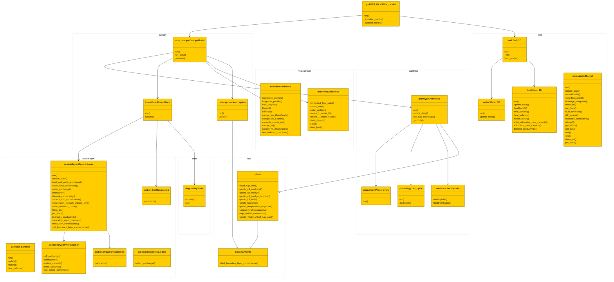

```mermaid
%%{init: {'theme': 'base', 'themeVariables': { 'primaryColor': '#ffcc00', 'edgeLabelBackground':'#ffffff', 'tertiaryColor': '#fff'}}}%%
classDiagram
    class pyAPES_MLM.MLM_model {
        run()
        _initialize_results()
        _append_results()
    }
    pyAPES_MLM.MLM_model --> mlm_canopy.CanopyModel
    pyAPES_MLM.MLM_model --> soil.Soil_1D

    namespace bottomlayer {
        class baresoil_Baresoil {
            run()
            update()
            restore()
            heat_balance()
        }
        class organiclayer.OrganicLayer {
            run()
            update_state()
            heat_and_water_exchange()
            water_heat_tendencies()
            water_exchange()
            reflectance()
            thermal_conductivity()
            surface_atm_conductance()
            evaporation_through_organic_layer()
            water_retention_curve()
            theta_psi()
            psi_theta()
            hydraulic_conductivity()
            saturation_vapor_pressure()
            moss_atm_conductance()
            soil_boundary_layer_conductance()
        }
        class carbon.BryophyteFarquhar {
            co2_exchange()
            conductance()
            relative_capacity()
            photo_farquhar()
            topt_deltaS_conversion()
        }
        class carbon.OrganicRespiration {
            respiration()
        }
        class carbon.BryophyteCarbon {
            carbon_exchange()
        }
        class carbon.SoilRespiration {
            respiration()
        }
    }
    organiclayer.OrganicLayer --> carbon.BryophyteFarquhar
    organiclayer.OrganicLayer --> carbon.OrganicRespiration
    namespace canopy {
        class forestfloor.ForestFloor {
            run()
            update()
        } 
        class mlm_canopy.CanopyModel {
            run()
            run_daily()
            _restore()
        }
        class interception.Interception {
            run()
            update()
        }
    }
    forestfloor.ForestFloor --> organiclayer.OrganicLayer
    forestfloor.ForestFloor --> carbon.SoilRespiration
    forestfloor.ForestFloor --> DegreeDaySnow
    mlm_canopy.CanopyModel --> planttype.PlantType
    mlm_canopy.CanopyModel --> forestfloor.ForestFloor
    mlm_canopy.CanopyModel --> radiation.Radiation
    mlm_canopy.CanopyModel --> micromet.Micromet
    mlm_canopy.CanopyModel --> interception.Interception
    interception.Interception --> boundarylayer
    photo --> boundarylayer

    namespace leaf {
        class boundarylayer {
            +leaf_boundary_layer_conductance()
        }
        class photo {
            +lead_Ags_ebal()
            +photo_c3_analytical()
            +photo_c3_medlyn()
            +photo_c3_medlyn_farquhar()
            +photo_c3_bwb()
            +photo_farquhar()
            +photo_temperature_response()
            +apparent_photocapacity()
            +topt_deltaS_conversion()
            +photo_Toptima()leaf_Ags_ebal()
        }
    }

    namespace microclimate {
        class micromet.Micromet {
            normalized_flow_stats()
            update_state()
            scalar_profiles()
            closure_1_model_U()
            closure_1_model_scalar()
            mixing_length()
            e_sat()
            latent_heat()
        }
        class radiation.Radiation {
            shortwave_profiles()
            longwave_profiles()
            solar_angles()
            kbeam()
            kdiffuse()
            canopy_sw_ZhaoQualls()
            canopy_sw_Spitters()
            compute_clouds_rad()
            canopy_lw()
            canopy_lw_ZhaoQualls()
            test_radiation_functions()
        }
    }

    namespace planttype {
        class phenology.Photo_cycle {
            run()
        }
        class phenology.LAI_cycle {
            run()
            daylength()
        }
        class planttype.PlantType {
            run()
            update_daily()
            leaf_gas_exchange()
            _outputs()
        }
        class rootzone.RootUptake {
            wateruptake()
            RootDistribution()
        }
    }
    planttype.PlantType --> phenology.Photo_cycle
    planttype.PlantType --> phenology.LAI_cycle
    planttype.PlantType --> rootzone.RootUptake
    planttype.PlantType --> photo

    namespace snow {
        class DegreeDaySnow {
            update()
            run()
        }
    }

    namespace soil {
        class soil.Soil_1D {
            run()
            _fill()
            form_profile()
        }
        class heat.Heat_1D {
            run()
            update_state()
            heatflow1D()
            heat_content()
            heat_balance()
            frozen_water()
            solid_volumetric_heat_capacity()
            volumetric_heat_capacity()
            thermal_conductivity()
        }
        class water.Water_1D {
            run()
            update_state()
        }
        class water.WaterBucket {
            run()
            update_state()
            waterFlow1D()
            waterStorage1D()
            drainage_hooghoud()
            theta_psi()
            psi_theta()
            h_to_cellmoist()
            diff_wcapa()
            hydraulic_conductivity()
            relcond()
            gwl_Wsto()
            get_gwl()
            rew()
            wrc()
            theta_psi()
            psi_theta()
        }
    }
    soil.Soil_1D --> water.Water_1D
    soil.Soil_1D --> heat.Heat_1D
    
```